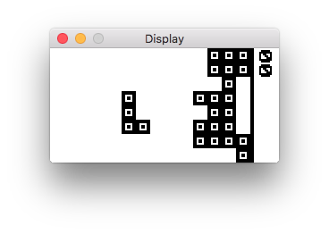
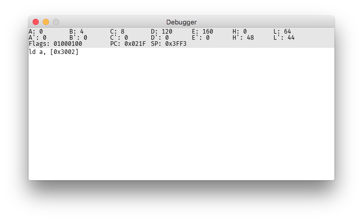

# computer-emu
An emulator for the Soviet-era microcomputer I built. See [this repository](https://github.com/thatoddmailbox/computer) for more information.





## Usage
You will need Go installed and set up properly to build the emulator.

You'll also need SDL2 and SDL_ttf. On a Mac, you can use Homebrew: `brew install sdl2 sdl2_ttf`. Finally, you'll need the [Fira Code](https://github.com/tonsky/FiraCode) font installed. (it's used for text in the debugger) You can [change the font path](https://github.com/thatoddmailbox/computer-emu/blob/master/debugger/debugger.go#L70) if you want to use a different font or aren't on a Mac.

```shell
go get https://github.com/thatoddmailbox/computer-emu
cd ~/go/src/github.com/thatoddmailbox/computer-emu # you might need to change this depending on the location of your GOPATH
go install
~/go/bin/computer-emu --weird-mapping --random-ram
```

The `--weird-mapping` flag enables the modified address decoding, which was necessary to adapt modern-day ROM and RAM chips to the computer when the Soviet parts were found to be defective. The `--random-ram` randomizes the contents of RAM before the computer starts up, helping to catch bugs with usage of uninitalized memory. 

The emulator requires ROM files to run, which can be assembled from [the firmware source code](https://github.com/thatoddmailbox/computer-fw) using [z80asm](https://github.com/thatoddmailbox/z80asm). Once assembled, you will need to place the two ROM files, `rom0.bin` and `rom1.bin`, in the working directory of the terminal you launch the emulator from. (this will probably be the folder with the emulator's source code in it)